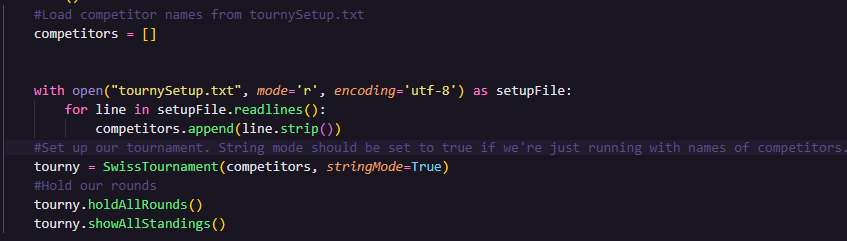

# Tournaments
---
A basic Python library for holding tournaments. Comes with an ELO system and Competitor classes.

# About
---
This is a quick and dirty library for hosting tournaments between competitors. It attempts to use a Swiss-like system for holding tournaments where competitors face off against eachother. 

# Getting Started
---
## Prerequisites
These are the following prerequisites.
* numpy
```sh
pip install numpy
```
## Installation
1. Clone the repo
```sh
git clone https://github.com/LuxSona/tournaments.git
```
2. Install all prerequisites. 
3. Change your remote URL to avoid any accidental pushes.
# Usage
---
Run your Tournaments using the constructor. You can then host the matchups using the built in `holdAllRounds` function.
The following is a code-snippet which demonstrates how to use the `holdAllRounds` function.

# License
---
MIT License. See LICENSE
# Contributors
---
- Luxsona
